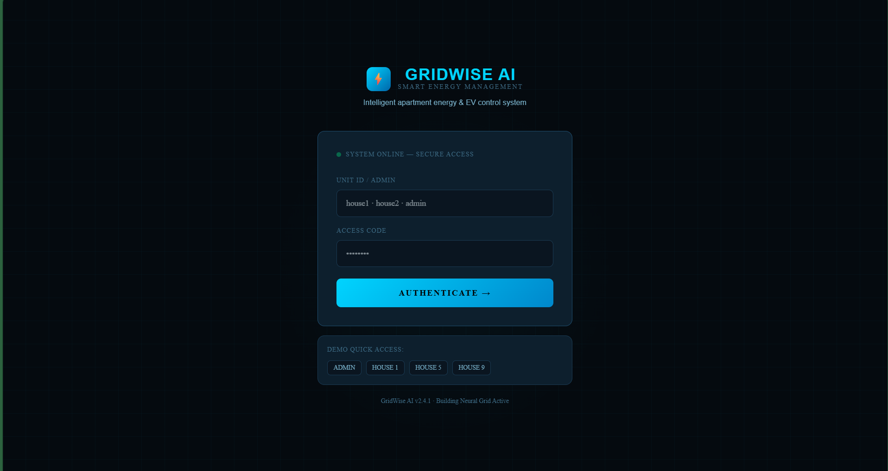
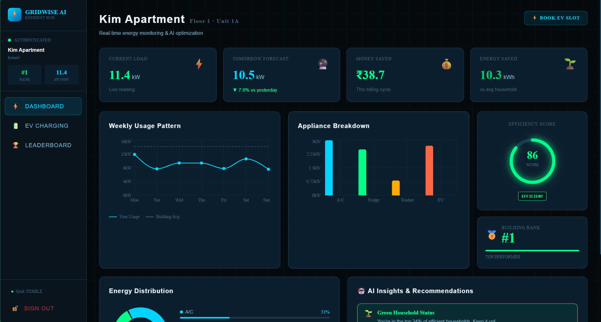
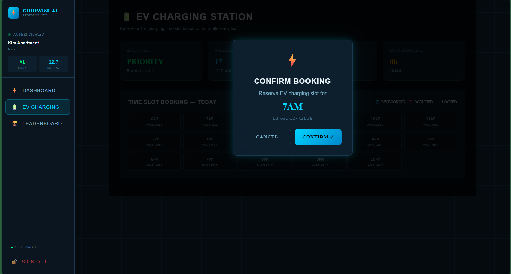
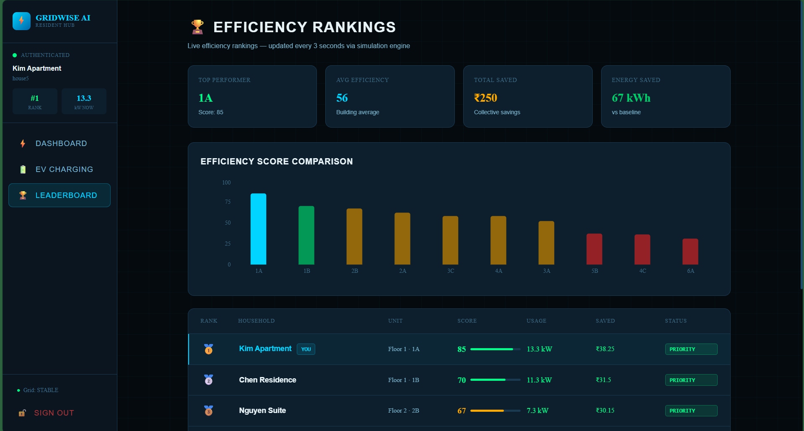
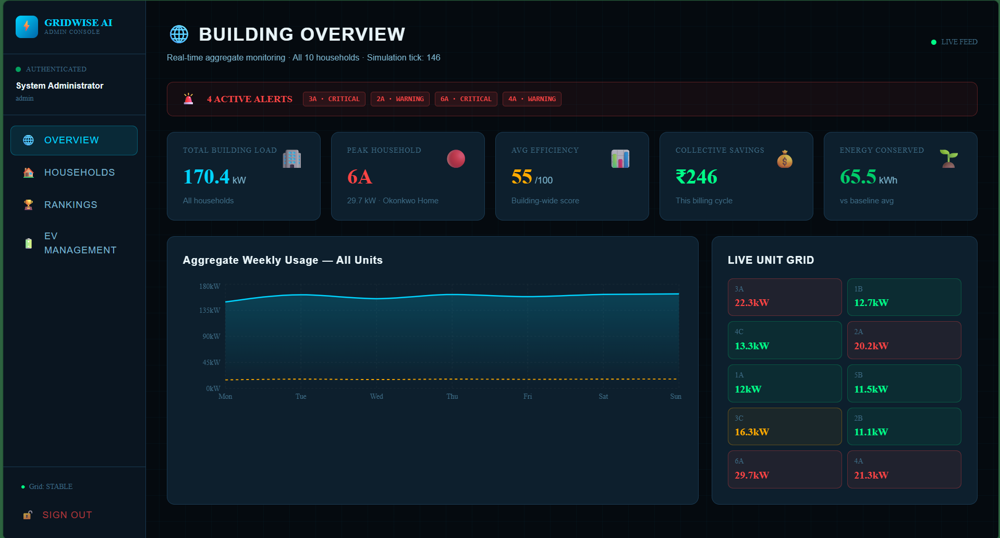
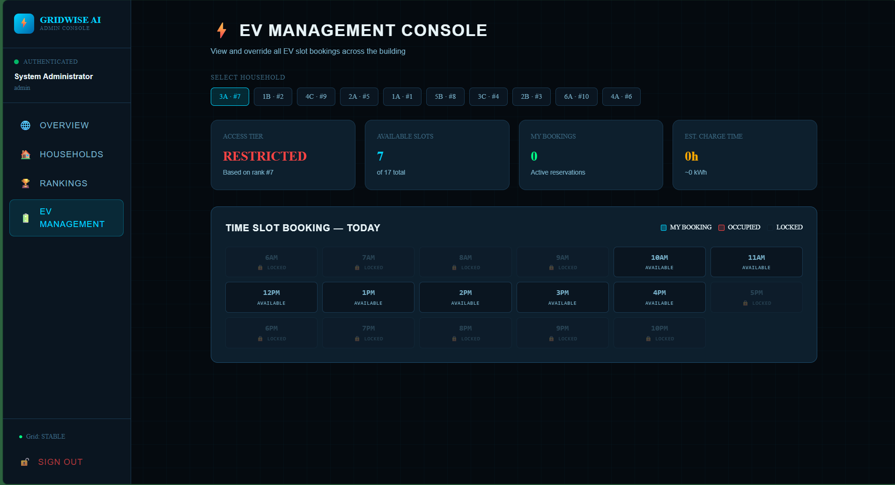

# ⚡ GridWise AI — Smart Apartment Energy & EV Management System

> A next-generation intelligent energy management platform for residential apartments that monitors consumption, predicts usage, and actively guides residents toward smarter energy decisions.

---

## 🌐 Overview

**GridWise AI** is a frontend single-page application that simulates an intelligent energy and EV management system for a residential apartment building. It monitors real-time household power consumption, predicts usage patterns, generates AI-driven insights, and controls EV charging slot access — all in a sleek, Tesla-inspired dark UI.

---

## 💡 Problem Statement

Residential apartments waste enormous amounts of energy because:
- Residents have **zero visibility** into their own consumption patterns
- There is **no fair system** for controlling EV charging access during peak hours
- No intelligent guidance exists to help residents **reduce bills proactively**

GridWise AI addresses all three.

---

## ✨ Features

### 🏠 Resident Dashboard
- Live current load, tomorrow's AI-predicted usage, money saved & energy saved stats
- Weekly usage line chart vs building average
- Appliance-level breakdown (A/C · Fridge · Washer · EV) via bar and pie charts
- Animated efficiency score gauge (0–100)
- Real-time building rank display

### 🤖 AI Insights Panel
- Auto-generates personalized recommendations based on live appliance data
- Detects overuse patterns (e.g. high AC load, inefficient EV scheduling)
- Critical and warning alerts triggered dynamically by usage thresholds

### 🔋 EV Charging Slot Booking
- 17 time slots (6AM – 10PM) displayed in a visual booking grid
- **Rank-gated access** — top-ranked households unlock all slots; lower-ranked households are restricted to off-peak hours
- Confirm / cancel bookings with modal confirmation
- Real-time slot state: Available · My Booking · Occupied · Locked

### 🏆 Efficiency Leaderboard
- Dynamically sorted rankings across all 10 households
- Live efficiency score bar chart with your unit highlighted
- Tier badges: PRIORITY · STANDARD · LIMITED

### 🌐 Admin Console
- Aggregate building load overview with area chart
- Live unit grid heatmap (green → amber → red by load)
- Click-through household detail view with full analytics
- EV management: view, override, and revoke bookings per household

### ⚙️ Simulation Engine
- `setInterval` fires every **3 seconds** to:
  - Randomly vary household usage
  - Recalculate efficiency scores
  - Update predictions
  - Re-rank all 10 households live

---

## 🛠 Tech Stack

| Layer | Technology |
|---|---|
| Frontend Framework | React 18 (Vite) |
| Styling | Tailwind CSS v4 |
| Charts | Recharts |
| State Management | React Context API |
| Auth & Persistence | localStorage (role-based) |
| Data | In-memory mock JSON with live simulation |
| Fonts | Inter · Rajdhani · Space Mono (Google Fonts) |

> No backend. No database. Fully client-side — runs entirely in the browser.

---

## 📁 Project Structure

```
gridwise/
├── public/
├── src/
│   ├── context/
│   │   └── AppContext.jsx       # Global state, simulation engine, auth
│   ├── data/
│   │   └── store.js             # Mock households, EV slots, insight logic
│   ├── components/
│   │   ├── Sidebar.jsx          # Navigation sidebar
│   │   └── UI.jsx               # StatCard, ChartCard, InsightPanel, Gauge, etc.
│   ├── pages/
│   │   ├── Login.jsx            # Auth page with quick-fill demo
│   │   ├── Dashboard.jsx        # Resident dashboard
│   │   ├── EVBooking.jsx        # EV slot booking UI
│   │   ├── Ranking.jsx          # Leaderboard page
│   │   └── Admin.jsx            # Admin console (overview, households, EV mgmt)
│   ├── App.jsx                  # Root component + routing logic
│   ├── main.jsx
│   └── index.css                # Global styles, CSS variables, dark theme
├── index.html
├── vite.config.js
└── package.json
```

---

## 🚀 Getting Started

### Prerequisites
- Node.js v18+
- npm v9+

### Installation

```bash
# 1. Clone the repository
git clone https://github.com/keerthanakumar2602-collab/energy_management-.git

# 2. Navigate into the project
cd energy_management-

# 3. Install dependencies
npm install

# 4. Start the development server
npm run dev
```

Open [http://localhost:5173](http://localhost:5173) in your browser.

### Build for Production

```bash
npm run build
```

---

## 🔐 Demo Credentials

| Role | Username | Password | Access |
|---|---|---|---|
| Admin | `admin` | `admin123` | Full building console |
| Resident (Top Rank) | `house5` | `pass5` | Priority EV access |
| Resident (Mid Rank) | `house1` | `pass1` | Standard EV access |
| Resident (Low Rank) | `house9` | `pass9` | Restricted EV slots |

> All 10 households follow the pattern: `house1`–`house10` / `pass1`–`pass10`

---

## 📸 Screenshots

| Login | Dashboard |
|---|---|
|  |  |

| EV Booking | Leaderboard |
|---|---|
|  |  |

| Admin Dashboard | EV Management |
|---|---|
|  |  |

---

## 🔭 Future Roadmap

- [ ] Real IoT meter integration (MQTT / WebSocket)
- [ ] Mobile app (React Native)
- [ ] DISCOM API integration for live tariff data
- [ ] Solar rooftop + net metering support
- [ ] AI voice assistant ("Why is my bill high?")
- [ ] Peer-to-peer energy trading between households
- [ ] Carbon credit tracking & marketplace
- [ ] Vehicle-to-Grid (V2G) support
- [ ] Blockchain energy ledger

---

<p align="center">Built by <strong>Keerthana K</strong></p>
